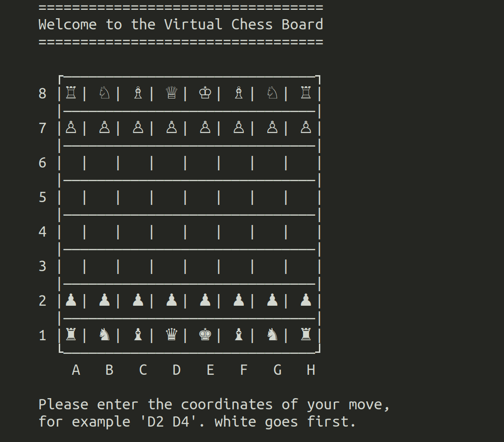

# chess-engine-imperial
A CLI chess game that allows 2 players to play a game of chess and have it visualised in the terminal using Unicode characters. The program validates legal moves and keeps track of the state of the game including checks, stalemates, checkmates, castling and pawn promotion. En passant is not yet implemented.

to complie using gcc run "make" and run the exeutable with "./chess"

